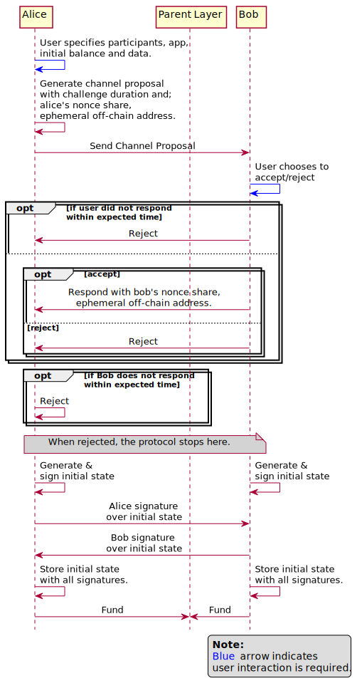

# Proposal: Mechanism for generating proposal ID

* Author(s): Manoranjith, Matthias Geihs
* Status: propose
* Related issue: https://github.com/hyperledger-labs/go-perun/issues/167 

## Summary

This proposal describes the need for proposal ID and the mechanism for
generating it.

## Motivation

Until now, Proposal ID was being generated by encoding all the parameters of a
proposal using perunio encoding scheme. Recently, an abstraction for wire
serialization was introduced (see
[#233](https://github.com/hyperledger-labs/go-perun/issues/233)), so that
different encoding schemes can be used for serializing wire messages. As a part
of this abstraction, it was needed to re-evaluate the mechanism for generating
the proposal ID, because it depended on a specific encoding scheme: perunio.

Also, considering the plans to implement an alternate perun state channels
client that can run on resource constrained embedded devices, documenting
different parts of the perun protocol makes it easier to keep these two
implementations consistent with each other.

## Details

### Need for proposal ID

Fig 1 shows the sequence of interactions between two participants for opening a
channel. It can be seen that, channel ID can be generated only after each of
the participants know the nonce share of every other participant. Hence, until
a channel ID can be generated, a unique identifier for identifying the channel
proposals is needed. For this purpose, the proposal ID was introduced.

### Expected properties for a proposal ID

It is sufficient for the proposal ID to be unique for each channel proposal. It
is not necessary to be able to derive the proposal ID from a channel proposal.

### Currently used mechanism

The proposal ID was generated by encoding the channel proposal along with the
nonce share of proposer. Perun protocol allows multiple options for nonce
share, such as using a monotonically increasing counters for each set of
participants or filling a byte array using a cryptographically secure random
number generator. In either case, the participant ensures that, the nonce share
for each proposal between a given set of participants is different. Hence, the
proposal ID was unique for each proposal generated by a participant.

### Issues with currently used mechanism

In [#233](https://github.com/hyperledger-labs/go-perun/issues/233),
abstractions for wire serialization were introduced. After this, it is possible
to use a different encoding scheme such as protocol buffers. For instance, if
two perun clients agree to use protocol buffers as the wire serialization
protocol, then it is not necessary for them support perunio encoding. Hence,
the mechanism for generating proposal IDs should work independent of a
particular encoding scheme.

### Mechanism for generating proposal ID

Since, it is not necessary to be able to derive the proposal ID from a channel
proposal, it can be generated by filling a byte array of fixed length using a
cryptographically secure random number generator. For now, the length of the
byte array is fixed at 32 bytes.

When using this mechanism, there are three possible scenarios where two channel
proposals can have same ID. In any case, if a user receives multiple channel
proposals with the same ID, they can process only the first one and reject the
latter requests.

1. When a user (say Alice) intentionally tries to send two proposals to another
   user Bob, with the same proposal ID.

   Because Bob receives two proposals with the same proposal ID, they could
   process only the first and reject the second one. Since, this defeats the
   objective of Alice (to establish a channel with Bob), Alice has no incentive
   to do this.

2. By coincidence, if two users generate the same proposal ID.

   When using a cryptographically secure random number generator with
   sufficient entropy, the possibility of this occurring is very rare. Even if
   it occurs due to a rare coincidence, Bob could simply reject the second
   proposal with the same ID.

3. An adversary (say Mallory) tries to intercept the communication between two
   users (say Alice and Bob) and channel proposals with the same ID.

   This situation only occurs when mallory uses the same message bus as Alice
   and Bob or when the connection between them is not properly secured (say,
   for example, without using TLS). However, this is beyond the scope of the
   proposed change here.

## Figures

**Figure 1**: Sequence of interactions for opening a channel.

## Rationale

Two alternate approaches were evaluated.

1. One approach was to expose interfaces in the wire serialization abstraction,
   that can encode a channel proposal using the underlying encoding scheme.

   But, using the wire serialization abstraction for purposes other wire
   serialization appeared to mix up the two different concerns of serializing
   wire messages and generating proposal IDs. Hence, this approach was not
   preferred.

2. The other approach was to reuse the proposer's nonce share as the proposal
   ID.

   One allowed approach for generating nonce share is to use monotonically
   increasing counters for each set of participants (see [previous
   section](currently-used-mechanism)). When two users (say Alice and Bob) want
   to individually propose a channel to a third user (say Carol), there is good
   possibility for Carol to receive two proposals (one each from Alice and Bob)
   with the same proposal ID, if there both Alice and Bob are using
   monotonically increasing counters. This would defeat the purpose of proposal
   ID, which is to enable a user to uniquely identify a channel proposal.
   Hence, this approach was dropped.

## Impact

Minor (Does not impact any existing features)
<!-- Major (Breaks one or more existing features) -->
<!-- New Feature (Introduces a functionality) -->
<!-- Architecture (Requires a modification of the architecture) -->

## Implementation

<!-- Provide a description of the implementation aspects. -->

At the framework level (go-perun or other implementations), a cryptographically
secure random source should be used for generating proposal IDs.

At the node level, the node should implement mechanism to detect proposals with
a duplicate proposal ID and automatically reject those proposals.
